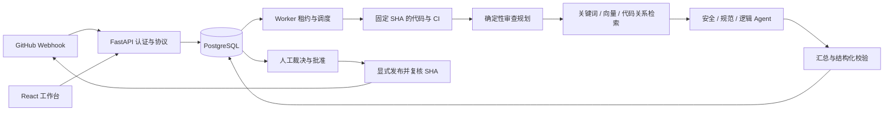

# 架构与取舍

OpenReviewer 面向一个团队的多个 GitHub 仓库。它读取 PR、组织模型审查、保存可恢复的结果，
把是否批准、是否发布和是否修复交给具有权限的成员。

## 主流程

外部 HTTP 不持有数据库事务。数据库保存的是阶段事实、租约、版本和已完成结果，Worker
可以在进程重启后重新领取任务，成功批次继续复用。

## 模块边界

新增外发检查放在模型请求边界；静态报告解析与存储分别归入 `services/static_analysis.py`
和 `persistence/static_analysis.py`；方案质量使用 `persistence/profile_quality.py` 复用现有
评测聚合；精确输入归一化与复用存储分别放在 `services/review_reuse.py` 和
`persistence/review_reuse.py`。这些模块继续共享现有事务、授权和分页机制，不增加服务进程。

| 目录 | 职责 |
| --- | --- |
| `domain/` | 状态、结构化输出、版本和输入规则，不依赖 Web 或数据库 |
| `services/` | 审查、检索、配置捕获、人工经验整理及供应商协议 |
| `persistence/models/` | 按任务、身份、配置、知识、结果、评测、检索划分的记录，共用一个 Base |
| `persistence/queue/` | 心跳、领取、上下文、规划、批次、结果与预算的阶段存储 |
| `persistence/management/` | 详情查询、人工动作、裁决、重试和外部发布存储 |
| `apps/worker/` | 启动、运行循环、租约心跳、批次执行、审查阶段与 Agent 编排 |
| `apps/api/routes/` | 登录身份、同源保护、参数与响应转换 |
| `web/src/http.ts` | 同源请求、超时、请求合并和有界缓存 |
| `web/src/*Panel.tsx` | 按业务拆分的页面区域，复用稳定游标分页 |

`persistence/task_queue.py` 与 `persistence/review_management.py` 保留稳定门面，组合具体阶段
操作。存储上下文只提供会话工厂、时钟和必要协作者；阶段模块不会反向导入门面。

此次拆分针对原先集中在约 3,900 行队列、2,800 行管理存储、2,800 行 Worker 入口和
2,300 行 ORM 文件中的混合职责。保留现有行为契约和部署方式，降低修改某个阶段时的影响范围。

## 关键取舍

**PostgreSQL 同时保存任务与业务事实。** 当前是有限仓库、有限 Worker 的团队场景。
任务、审查运行和 Outbox 能在同一事务提交；唯一键负责接收幂等，行锁和租约负责执行权。
同一任务可能因故障被再次处理，外部动作因此仍需要幂等与对账，不能声称端到端 exactly-once。

**固定 DAG 负责审查编排。** 安全、规范、逻辑三路按适用文件并发，汇总独立执行。
每批都有状态、尝试次数、租约和检查点。当前不需要模型决定任意工具调用顺序，固定流程便于
恢复、计费和审计；采用何种编排库不是衡量工程可靠性的依据。

**运行状态与工作流状态分别表达。** `execution_status` 服务于队列兼容，`workflow_status`
表达人工批准和发布阶段。AI 结果保存完成时，任务仍可能等待审批。所有新功能按真实工作流
状态判断待办，保留两者的投影关系。

**配置发布与运营控制分开生效。** 不可变方案冻结模型、Prompt、知识内容和检索参数；仓库
绑定在创建任务时进入策略快照。月度预算与仓库并发上限在下一次请求、领取时读取当前值。
操作人员可以止损，同时不改变已经执行一半的审查依据。

**人工处理与模型判断分开存储。** Finding 的有效性、跨提交算法追踪、人工修复状态和评测
标签代表不同事实。新工作项不会因 AI 某次没有再次发现问题而自动完成。知识草稿来自明确的
人工处理结论，审核启用后才参加对应仓库的检索。

**查询先限定范围再返回结果。** 列表、聚合和详情均在数据库侧应用仓库/安装范围；正文单独
加载。权限过滤后再分页，避免泄漏其他仓库的记录或总数。

## 可靠性边界

- 任务租约防止旧 Worker 写回；进程心跳身份防止旧实例接管新实例的在线状态。
- 预算在 HTTP 前预占，结算使用请求状态比较更新；超时和缺失用量不会被记为免费。
- 共享供应商通道通过短事务处理并发准入与熔断，HTTP 在提交之后执行。
- 人工编辑使用版本号检测冲突。外部发布使用稳定标识对账，并再次读取 PR SHA。
- 密钥使用带用途关联数据的 AES-GCM；方案凭据参与批量轮换。轮换的加解密在事务外完成，写回
  比较旧密文，防止覆盖管理员同时更新的凭据。

当前服务单团队，不宣称已经具备独立企业之间的租户隔离。真实审查质量、公网延迟和生产
容量分别需要相应测量；自动化回归只证明其覆盖的行为与数据范围。

## 评测、版本与运维证据

评测集创建时固定 single/dual；历史默认单人。双人模式先独立提交再查看他人判断，分歧与
未完成不进入严格质量配对；参考匹配和定位分别判定。配对必须同 PR/SHA、不同运行、来源
完整且没有跨提交审查复用；20 组参考配对等方案验收条件不降低。稳定方案指纹和各次实际
执行的角色/知识子集分开保存，防止把输入差异当作方案混用。

候选复制基础方案，只允许修改角色指令和补充要求。固定系统协议不开放编辑；协议版本与
Prompt 内容 SHA 分开，旧快照身份兼容。试跑建立独立运行，关闭结果复用，不修改仓库绑定，
并由服务端阻止发布到 GitHub。预算、仓库范围和外发限制仍按现有边界执行。

指定评测可以在解析前捕获供应商可见答案，捕获表与当前 `model_usage_requests.id` 一一关联，
纠错/重试/拆分分别记录。默认关闭；256 KiB/请求、8 MiB/运行、30 天正文保留。流式重组
明确标记，独立 reasoning/thinking 字段不采集；它不是完整网络报文。清理源任务保留来源元数据。
受控导出保存工作流快照、调用、人工结论和哈希，复算使用原报告算法；原始正文不进入日常接口
或普通日志。报告与原始材料分开保存，不把结构化问题当作模型的未处理回答。

用量与诊断在授权仓库和时间窗内聚合。费用未知、用量不确定、HTTP 状态与业务成功独立表达；
完成运行均价归集这些运行全部月份请求。批次领取、Agent 整组缓存、索引复用、审查消费复用
分别报告，避免把可见代理指标变成未经证明的模型质量或真实账单节省。
应用以标准 logging 输出固定字段的 JSON；API 请求 ID 与持久运行身份通过提交事件关联，
线程池显式复制上下文，无新日志服务。部署仍复用现有 Compose、Prometheus 和 Alertmanager。
